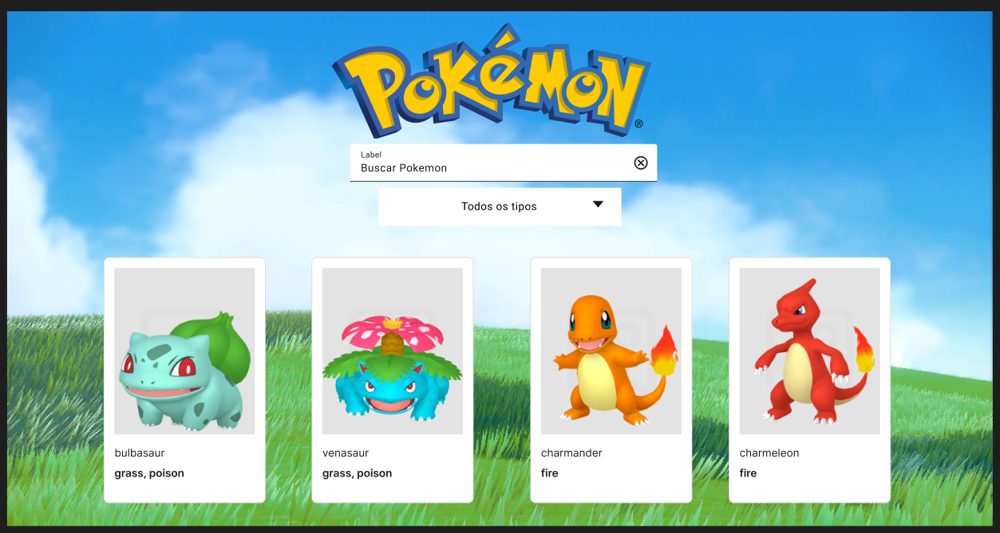

# Pokedex

## Descrição
Este projeto é uma Pokédex interativa que permite aos usuários buscar e visualizar informações sobre Pokémon. Utiliza HTML, CSS e JavaScript, integrando-se a uma API para obter dados dos Pokémon.

## Estrutura do Projeto
O projeto possui a seguinte estrutura de pastas e arquivos:


src/                  # Diretório principal do código-fonte
│
├── assets/           # Contém recursos estáticos
│   ├── icons/        # Ícones dos tipos dos Pokémon
│   └── images/       # Imagens de fundo e logo
│
├── css/
│   ├── details/
│   │   ├── mobile/
│   │   │   └── mobile.css   # Estilos específicos para dispositivos móveis na página de detalhes
│   │   └── details.css      # Estilos principais da página de detalhes
│   ├── index/
│   │   ├── card/
│   │   │   └── card.css     # Estilos específicos para os cards de Pokémon
│   │   ├── header/
│   │   │   └── header.css   # Estilos do cabeçalho da página principal
│   │   ├── mobile/
│   │   │   └── mobile.css   # Estilos para dispositivos móveis na página principal
│   │   └── styles.css       # Estilos gerais da página principal
├── js/
│   ├── card/
│   │   └── card.js          # Funções para criar os cards de Pokémon
│   ├── constants/
│   │   └── constants.js     # URL da API e referências a elementos HTML
│   ├── details/
│   │   └── details.js       # Funções para exibir detalhes do Pokémon
│   ├── errors/
│   │   └── errors.js        # Funções para tratar erros nas requisições
│   ├── fetchApi/
│   │   └── fetchfunctions.js# Funções para buscar dados da API
│   └── main.js              # Lógica principal da aplicação
├── details.html             # Página de detalhes do Pokémon
└── index.html               # Página principal com listagem de Pokémon


### Arquivos Principais
- **index.html**: Página inicial onde os usuários podem buscar Pokémon.
- **details.html**: Página que exibe detalhes específicos de um Pokémon selecionado.

## Instalação
Para executar o projeto localmente, siga os passos abaixo:

1. Clone o repositório:
   ```bash
   git clone https://github.com/bebshow2/guilherme-pokeapi.git

2. Navegue até o diretório do projeto:

cd guilherme-pokeapi

### Uso

1. **Na página inicial (`index.html`)**, digite o nome de um Pokémon no campo de busca.
2. **Os resultados** aparecerão abaixo.
3. **Use o filtro de tipo** para limitar a busca por tipos específicos de Pokémon.
4. **Clique em “Ver mais”** para ver mais detalhes sobre o Pokémon na página `details.html`.

### Tecnologias Utilizadas

- **HTML**
- **CSS (Bootstrap)**
- **JavaScript (ES6+)**

### Contribuição

Contribuições são bem-vindas! Sinta-se à vontade para abrir issues ou pull requests.


### Melhorias Feitas:
- Estrutura do projeto foi detalhada.
- Instruções de instalação foram adicionadas.
- A seção de uso agora inclui informações sobre o filtro de tipos.

Sinta-se à vontade para adaptar qualquer parte conforme suas preferências!


